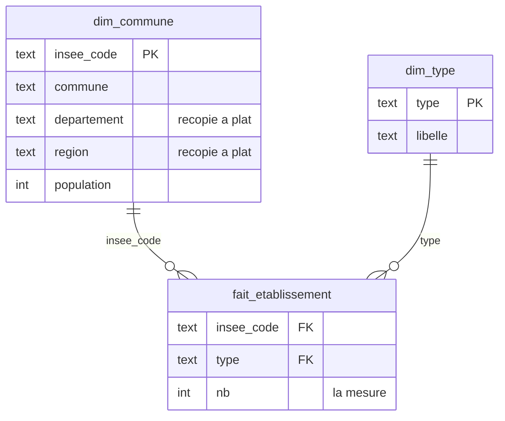

# Brief 07 : l'entrepôt en étoile

> Objectif : construire un entrepôt de données en modèle en étoile, alimenté
> depuis la base de collecte du [brief 03](03_brief_integration.md), et y réécrire
> des requêtes du [brief 04](04_brief_requetes_analytiques.md).

> Compétences visées (RNCP-37638) : **C13, niveau 1-2** (modéliser faits et
> dimensions), **C14, niveau 1** (créer l'entrepôt), **C15, niveau 2** (l'alimenter
> par un ETL).

## Contexte

Les requêtes territoriales du [brief 04](04_brief_requetes_analytiques.md)
répètent toutes ces deux mêmes opérations : 
- pré-agréger chaque typologie (une sous-requête `GROUP BY` par table, contre la jointure en éventail) 
- remonter la hiérarchie `commune -> departement -> region`

> Un entrepôt stocke le résultat de ces opérations dans des tables dédiées à l'analyse. Les opérations sont faites une fois, au chargement, au lieu d'une fois par requête.

À la fin du brief, "combien d'établissements de chaque type, par département"
s'écrira ainsi (et quasi toutes les requêtes sur l'étoile ont cette forme) :

```sql
SELECT d.departement, f.type, sum(f.nb) AS n
FROM entrepot.fait_etablissement f
JOIN entrepot.dim_commune d ON d.insee_code = f.insee_code
GROUP BY d.departement, f.type
ORDER BY d.departement, n DESC;
```

Une jointure, aucune sous-requête. 
L'objectif de ce brief est entre autres de construire les tables qui rendent cette requête possible.

> 🔴 Si l'API d'une des typologies est capricieuse, vous pouvez à tout moment remplacer la typologie étudiée par une autre.

> 🔴 En revanche, la géographie (`commune`, `departement`, `region`) doit être
> en base : tout l'entrepôt s'appuie dessus. Si elle manque, rejouez `main.py`
> sur au moins un département avant de commencer.

## 1. Point de départ

- Reprenez votre requête du brief 04 qui compte les établissements par type et
  par département. Aussi, voici celle du corrigé :

```sql
SELECT d.name AS departement,
       coalesce(ly.n, 0) AS lycees,
       coalesce(co.n, 0) AS colleges,
       coalesce(ph.n, 0) AS pharmacies,
       coalesce(eh.n, 0) AS ehpad,
       coalesce(bi.n, 0) AS biblios
FROM departement d
LEFT JOIN (SELECT c.code_departement, count(*) n FROM lycee        x JOIN commune c ON c.insee_code = x.insee_code GROUP BY c.code_departement) ly ON ly.code_departement = d.code_departement
LEFT JOIN (SELECT c.code_departement, count(*) n FROM college      x JOIN commune c ON c.insee_code = x.insee_code GROUP BY c.code_departement) co ON co.code_departement = d.code_departement
LEFT JOIN (SELECT c.code_departement, count(*) n FROM pharmacie    x JOIN commune c ON c.insee_code = x.insee_code GROUP BY c.code_departement) ph ON ph.code_departement = d.code_departement
LEFT JOIN (SELECT c.code_departement, count(*) n FROM ehpad        x JOIN commune c ON c.insee_code = x.insee_code GROUP BY c.code_departement) eh ON eh.code_departement = d.code_departement
LEFT JOIN (SELECT c.code_departement, count(*) n FROM bibliotheque x JOIN commune c ON c.insee_code = x.insee_code GROUP BY c.code_departement) bi ON bi.code_departement = d.code_departement
ORDER BY pharmacies DESC
LIMIT 15;
```

- Comptez : 14 lignes, 5 sous-requêtes (une par typologie), 5 `LEFT JOIN`, plus
  la remontée commune -> departement. C'est le point de comparaison de
  l'étape 5.

## 2. Le modèle cible

Trois tables : une table de **faits** au centre, deux **dimensions** autour.
C'est le modèle en étoile : chaque ligne de faits pointe vers ses dimensions,
et les requêtes joignent le centre avec la branche dont elles ont besoin.



`dim_commune` : une ligne par commune, géographie à plat. Le département et la
région sont recopiés sur chaque ligne.

| insee_code | commune | departement | region | population |
|---|---|---|---|---|
| 69123 | Lyon | Rhône | Auvergne-Rhône-Alpes | 522250 |
| 69058 | Chiroubles | Rhône | Auvergne-Rhône-Alpes | 434 |
| 59350 | Lille | Nord | Hauts-de-France | 236234 |

`dim_type` : une ligne par type d'établissement.

| type | libelle |
|---|---|
| lycee | Lycée |
| college | Collège |
| pharmacie | Pharmacie |
| ehpad | EHPAD |
| bibliotheque | Bibliothèque |

`fait_etablissement` : une ligne = le nombre d'établissements d'un type dans une
commune. Cette définition (ce que représente une ligne de faits) s'appelle le
**grain** de la table. Il se fixe avant d'écrire le schéma. Avec les vraies
valeurs de la base, Lyon occupe cinq lignes (une par type présent) et
Chiroubles une seule :

| insee_code | type | nb |
|---|---|---|
| 69123 | pharmacie | 158 |
| 69123 | lycee | 68 |
| 69123 | college | 57 |
| 69123 | ehpad | 45 |
| 69123 | bibliotheque | 17 |
| 69058 | bibliotheque | 1 |

🔴 À retenir :

- Dans la base de collecte, "combien de pharmacies à Lyon ?" se calcule : la
  table `pharmacie` contient 158 lignes en 69123 (une ligne par officine, avec
  nom, adresse, téléphone), et chaque requête du brief 04 refaisait le
  `count(*) ... GROUP BY insee_code` pour les compter. Dans l'entrepôt, ce
  comptage est exécuté **une fois, au chargement** (étape 4), et son résultat
  est stocké : la ligne `(69123, pharmacie, 158)`. C'est ça, "pré-agrégé" :
  les requêtes ne comptent plus, elles lisent un compte déjà fait.
- Chiroubles n'a ni lycée ni pharmacie : **pas de ligne**, pas de zéro stocké.
  C'est pour ça que la requête 1.3 du brief 04 avait besoin de `coalesce` pour
  afficher des 0, et c'est toujours vrai sur l'étoile si on veut un tableau
  complet.

## 3. Le schéma

L'entrepôt vit dans la même base, dans un schéma séparé :

```sql
CREATE SCHEMA IF NOT EXISTS entrepot;
```

Écrivez les trois `CREATE TABLE` (`entrepot.dim_commune`, `entrepot.dim_type`,
`entrepot.fait_etablissement`) dans un fichier `entrepot.sql`. Vérification :
`\dt entrepot.*` liste les trois tables.

## 4. L'alimentation

Dans `entrepot.sql`, à la suite des `CREATE TABLE` :

- `dim_commune` : un `INSERT ... SELECT` depuis `commune` jointe à `departement`
  et `region`. Cette jointure n'apparaît plus ensuite dans les analyses.
- `dim_type` : un `INSERT ... VALUES`, la liste des types est connue d'avance.
- `fait_etablissement` : pour chaque typologie, un
  `SELECT insee_code, 'pharmacie', count(*) ... GROUP BY insee_code`, assemblés en
  `UNION ALL` dans un seul `INSERT`.

Règle de rejouabilité : l'entrepôt se reconstruit, il ne se met pas à jour. Chaque
`INSERT` est précédé d'un `TRUNCATE` de sa table. Vérification :

```bash
psql -d megabase0 -f entrepot.sql
```

lancé deux fois donne les mêmes `count(*)`.

> Sans `psql` (Windows notamment) : [outils/run_sql.py](../outils/run_sql.py)
> exécute un fichier `.sql` avec psycopg2 (`python run_sql.py entrepot.sql`),
> et pgAdmin sait ouvrir et exécuter un fichier. Pour `\dt entrepot.*`,
> pgAdmin montre les tables dans son arborescence.

## 5. Réécrire les requêtes du brief 04

Sur l'étoile, la requête de l'étape 1 devient celle annoncée dans le contexte :

```sql
SELECT d.departement, f.type, sum(f.nb) AS n
FROM entrepot.fait_etablissement f
JOIN entrepot.dim_commune d ON d.insee_code = f.insee_code
GROUP BY d.departement, f.type
ORDER BY d.departement, n DESC;
```

Une jointure, aucune sous-requête. Réécrivez de la même façon, dans
`analyses_etoile.sql` :

- le classement des départements par nombre de pharmacies ;
- la population par région et par département ;
- une requête de votre choix du brief 04.

Pour chacune, notez en commentaire le nombre de lignes de la version brief 04 et
de la version étoile.

## Bonus

- une `dim_temps` (2023, 2024) et des faits de fréquentation des gares, pour
  analyser l'évolution par année ;
- l'indicateur habitants par pharmacie du brief 04, recalculé sur l'étoile.

## Livrables

| Livrable | Forme |
|---|---|
| Le schéma en étoile et son alimentation, rejouables | `entrepot.sql` |
| Le grain de la table de faits, énoncé en une phrase | commentaire en tête du fichier |
| Trois requêtes du brief 04 réécrites, avec le compte de lignes avant / après | `analyses_etoile.sql` |

## Indicateurs de performance

- le grain est énoncé et respecté (une ligne = un compte commune × type) ;
- la géographie est à plat dans `dim_commune` : aucune jointure
  `commune -> departement -> region` dans `analyses_etoile.sql` ;
- `psql -f entrepot.sql` (ou `run_sql.py`) lancé deux fois donne le même
  entrepôt (i.e. il a bien été reconstruit) ;
- les requêtes réécrites sont plus courtes que leurs versions du brief 04, et
  l'étudiant sait expliquer pourquoi (la pré-agrégation est faite au chargement).

## Modalités

- Travail individuel.
- Prérequis : la base chargée ([brief 03](03_brief_integration.md)) et les
  requêtes analytiques ([brief 04](04_brief_requetes_analytiques.md)).
- Durée indicative : une journée.
